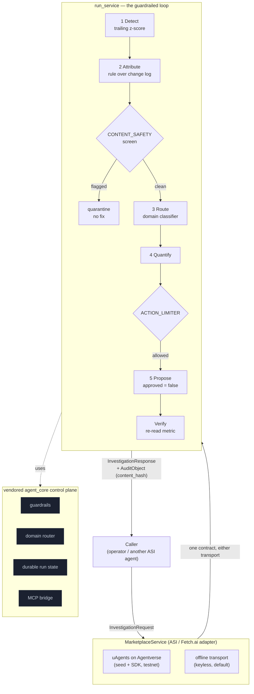

# Ledgerkeep

**A guardrailed autonomous operations agent, published as a decentralized AI service on the ASI / Fetch.ai stack.**

A payments configuration is pushed at 14:03. It routes one region's card traffic
to a gateway that declines most authorisations. Order volume still looks normal,
because customers keep trying to buy. Settled revenue quietly falls, and nobody
notices until the next morning. Ledgerkeep is the agent an on-call operator would
let near that problem: it detects the drop, attributes it to the exact change,
quantifies the loss, and proposes the one-line fix, returning a verifiable audit
object with every call. It proposes; a human owns the merge.


```text
$ python -m ledgerkeep

Ledgerkeep - guardrailed autonomous operations agent
      ASI / Fetch.ai service - transport=offline - offline_fixture - run run-...

[1/5] Detect     settled_revenue on 2026-08-25
      value $262,400 vs baseline $408,414  z=-3.81  -35.8%
[2/5] Attribute  EMEA settled revenue collapsed because gw-adyen-v2 is declining
      85% of EMEA authorisations. Attributed to the 14:03 config_push by deploy-bot.
[3/5] Quantify   EMEA settled revenue is 36% below baseline: about $146,014 unsettled.
[4/5] Propose    Fail EMEA card authorisations back to gw-stripe  (unapproved)
[5/5] Verify     Re-read after the proposed failover: the incident would clear.

guardrails enforced  ACTION_LIMITER, CONTENT_SAFETY, DOMAIN_ROUTER (3 decisions recorded)
audit content_hash   7d735e4ee91547f25deb2bd262182fd85439c0a87ed79c0c250ca0560a55fd25
```

## Why this is an ASI / Fetch.ai service

Deep Funding is explicit about funding decentralized AI *services*: agents that
others can discover, call, and pay for, while the builder keeps ownership. An
operations agent a team must trust is exactly that shape. Ledgerkeep is packaged
as a marketplace service with a stable, typed request and response, and an audit
object returned on every call so the caller can verify the chain from *a number
moved* to *this proposed fix*. The funder's technology is load-bearing behind an
adapter seam: when a seed phrase and the `uagents` SDK are present, the service
is a real uAgents endpoint on Agentverse (testnet only); otherwise it answers the
identical contract over an in-process transport, so it runs keyless.

## Architecture



## Run it

Everything runs with the standard library plus `python-dotenv`. No credentials,
no cloud project, no network.

```bash
python -m ledgerkeep            # narrate one guardrailed investigation
python -m ledgerkeep --json     # the full InvestigationResponse as JSON
python -m ledgerkeep --describe # the marketplace manifest a caller discovers
```

Call the service contract directly:

```python
from ledgerkeep.marketplace import MarketplaceService

service = MarketplaceService()
response = service.invoke({"metric": "settled_revenue"})
print(response.status)                     # "acted"
print(response.proposed_fix.approved)      # False — a human owns the merge
print(response.audit.content_hash)         # sha256 over the decision chain
```

## The service contract

- **`InvestigationRequest`** — typed, all-defaults, so the simplest call is
  `InvestigationRequest()`. Fields: `metric`, `z_threshold`, `note`,
  `request_id`, `contract_version`.
- **`InvestigationResponse`** — the typed reply. `anomaly`, `attribution`,
  `impact`, `proposed_fix` (always `approved=False`), `verification`,
  `delivery_mode` (`offline_fixture` | `live`, so a stub is never mistaken for a
  live figure), and a mandatory **`audit`**.
- **`AuditObject`** — returned on **every** call. Carries the run id, the ordered
  guardrail decisions by name, the classified domain, the recurrence record, and
  a sha256 `content_hash` over the decision chain. A response without an audit
  object is not a valid response.

## The guardrails

Autonomy is only safe when it is bounded. Every decision is recorded on the run
by name, so a claim of enforcement is a count of what happened.

| Guardrail | What it does | Tested by |
| --- | --- | --- |
| `CONTENT_SAFETY` | Screens the attribution before anything trusts it; a poisoned diagnosis quarantines the run with no proposed fix | `test_content_safety_quarantines_a_poisoned_attribution` |
| `ACTION_LIMITER` | Rate-caps the proposal; a zero-cycle cap blocks it and records the block | `test_action_limiter_blocks_the_proposal_when_the_cycle_cap_is_zero` |
| `DOMAIN_ROUTER` | Classifies the incident domain for the audit trail | `test_every_response_carries_a_full_audit_object` |

## Built on agent-core

The control plane is the vendored [`agent_core`](ledgerkeep/agent_core) package:
guardrails, a domain-aware router, durable run state with recurrence detection,
and an MCP bridge. It is vendored into this repo and exercised by its own tests
here, so the safety layer is not a promise for a later milestone.

## Milestone 1 scope, and what is not built

This repo is **milestone 1**: the re-themed service, the documented contract, the
audit object on every call, and the offline loop and guardrail suite running
green. There is no live marketplace publication, no mainnet, no durable state in
the tested path, and no users or revenue. See
[`docs/LIMITATIONS.md`](docs/LIMITATIONS.md) for the full, honest separation of
what has run from what has not.

## Cite

```bibtex
@software{sarkar_ledgerkeep_2026,
  author  = {Dipankar Sarkar},
  title   = {Ledgerkeep: A Guardrailed Autonomous Operations Agent as a Decentralized AI Service},
  year    = {2026},
  version = {0.1.0},
  url     = {https://github.com/doom2quake/ledgerkeep},
  license = {MIT}
}
```

Licensed MIT. Copyright (c) 2026 doom2quake.
