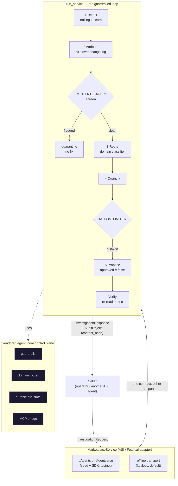
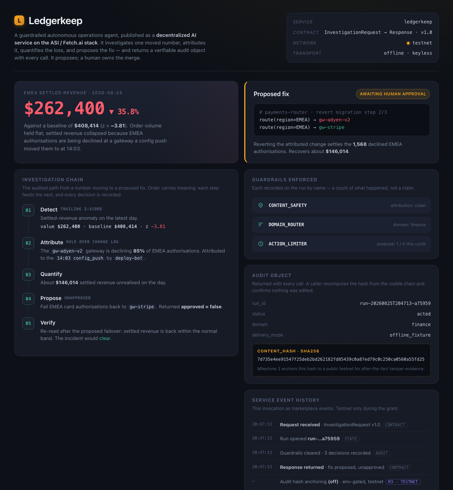

# Ledgerkeep

A guardrailed autonomous operations agent, published as a **decentralized AI
service** on the ASI / Fetch.ai stack. It detects a settled-revenue drop,
attributes it to the exact configuration change that caused it, quantifies the
loss, and proposes the one-line fix, returning a verifiable audit object with
every call. It proposes; a human owns the merge.

Every call answers one typed contract over either transport: a real uAgents
endpoint on Agentverse when a seed phrase and the SDK are present (testnet only),
or an in-process transport otherwise, so the service runs keyless. The safety
layer is not a promise for a later milestone; it is vendored, tested here, and
recorded by name on every run.

**Milestone 1** of the Ledgerkeep grant proposal: the re-themed service, the
documented contract, the audit object on every call, and the offline loop and
guardrail suite running green. Testnet only, never mainnet.

**[▶ Live demo](https://doom2quake.github.io/ledgerkeep/ui/)**  ·  **[Watch the walkthrough](https://youtu.be/LEDGERKEEP_VIDEO)**  ·  **[Paper (PDF)](paper/paper.pdf)**  ·  **[Deck (PDF)](deck/deck.pdf)**  ·  Built for the **[ASI Alliance](https://superintelligence.io/)**

Read [docs/LIMITATIONS.md](docs/LIMITATIONS.md) first for the short version of what
has run, what is simulated, and what is not built. Nothing on this page contradicts
it.

## The 30-second demo

```text
$ python -m ledgerkeep

Ledgerkeep - guardrailed autonomous operations agent
      ASI / Fetch.ai service - transport=offline - offline_fixture - run run-...

[1/5] Detect     settled_revenue on 2026-08-25
      value $262,400 vs baseline $408,414  z=-3.81  -35.8%
[2/5] Attribute  EMEA settled revenue collapsed because gw-adyen-v2 is declining
      85% of EMEA authorisations. Attributed to the 14:03 config_push by deploy-bot.
[3/5] Quantify   EMEA settled revenue is 36% below baseline: about $146,014 unsettled.
[4/5] Propose    Fail EMEA card authorisations back to gw-stripe  (unapproved)
[5/5] Verify     Re-read after the proposed failover: the incident would clear.

guardrails enforced  ACTION_LIMITER, CONTENT_SAFETY, DOMAIN_ROUTER (3 decisions recorded)
audit content_hash   7d735e4ee91547f25deb2bd262182fd85439c0a87ed79c0c250ca0560a55fd25
```

Step 4 is the one worth pausing on. The proposed fix is never applied: it comes
back with `approved=False` every time, so an autonomous run ends at a proposal a
human still has to merge. The step before it is the other one to notice: the
attribution is screened by `CONTENT_SAFETY` before anything downstream trusts it,
so a poisoned diagnosis quarantines the run with no proposed fix at all.

The same guarantees are enforced in the tested path, and `pytest` proves each of
them.

## Architecture



## Run it

Everything runs with the standard library plus `python-dotenv`. No credentials, no
cloud project, no network.

```bash
python -m ledgerkeep            # narrate one guardrailed investigation
python -m ledgerkeep --json     # the full InvestigationResponse as JSON
python -m ledgerkeep --describe # the marketplace manifest a caller discovers
```

Call the service contract directly:

```python
from ledgerkeep.marketplace import MarketplaceService

service = MarketplaceService()
response = service.invoke({"metric": "settled_revenue"})
print(response.status)                     # "acted"
print(response.proposed_fix.approved)      # False, a human owns the merge
print(response.audit.content_hash)         # sha256 over the decision chain
```

## The service contract

- **`InvestigationRequest`**: typed, all-defaults, so the simplest call is
  `InvestigationRequest()`. Fields: `metric`, `z_threshold`, `note`, `request_id`,
  `contract_version`.
- **`InvestigationResponse`**: the typed reply. `anomaly`, `attribution`,
  `impact`, `proposed_fix` (always `approved=False`), `verification`,
  `delivery_mode` (`offline_fixture` | `live`, so a stub is never mistaken for a
  live figure), and a mandatory **`audit`**.
- **`AuditObject`**: returned on **every** call. Carries the run id, the ordered
  guardrail decisions by name, the classified domain, the recurrence record, and a
  sha256 `content_hash` over the decision chain. A response without an audit object
  is not a valid response.

## The guardrails

Autonomy is only safe when it is bounded. Every decision is recorded on the run by
name, so a claim of enforcement is a count of what happened.

| Guardrail | What it does | Tested by |
| --- | --- | --- |
| `CONTENT_SAFETY` | Screens the attribution before anything trusts it; a poisoned diagnosis quarantines the run with no proposed fix | `test_content_safety_quarantines_a_poisoned_attribution` |
| `ACTION_LIMITER` | Rate-caps the proposal; a zero-cycle cap blocks it and records the block | `test_action_limiter_blocks_the_proposal_when_the_cycle_cap_is_zero` |
| `DOMAIN_ROUTER` | Classifies the incident domain for the audit trail | `test_every_response_carries_a_full_audit_object` |

## Built on agent-core

The control plane is the vendored [`agent_core`](ledgerkeep/agent_core) package:
guardrails, a domain-aware router, durable run state with recurrence detection, and
an MCP bridge. It is vendored into this repo and exercised by its own tests here,
so the safety layer is not a promise for a later milestone.

## Tests

- `PYTHONPATH=. pytest -q`, **82 Python tests**. No env vars or credentials needed;
  the suite cuts the socket, HTTP and subprocess layers before import and forces
  the run store in-memory. Service contract (10), guardrailed loop (7), marketplace
  adapter (10), fixture ledger (7), vendored `agent_core` (48).

Every defence in this repo has a test that fails without it.

## Built for the ASI Alliance and Deep Funding

Ledgerkeep is a candidate entry to [Deep Funding](https://deepfunding.ai/), the
grant programme of the [Artificial Superintelligence Alliance](https://superintelligence.io/)
(the [Fetch.ai](https://fetch.ai/), [SingularityNET](https://singularitynet.io/),
and Ocean Protocol federation). It is an application, not an accepted or funded
grant: there is no partnership with the Alliance and no endorsement, and nothing
here should be read as one.

The reason it belongs on the ASI stack rather than a closed SaaS is that Deep
Funding backs decentralized AI **services**: agents others can discover, call, and
pay for while the builder keeps ownership. An operations agent a team must trust is
exactly that shape. The funder's technology is load-bearing behind an adapter seam:
when a seed phrase and the [`uagents`](https://superintelligence.io/) SDK are
present, the service is a real uAgents endpoint on
[Agentverse](https://superintelligence.io/) (testnet only); otherwise it answers
the identical contract keyless. The milestone roadmap integrates the ecosystem
where it is needed: MCP composition so another ASI agent can call Ledgerkeep as a
tool (milestone 2), testnet audit-hash anchoring for verifiable provenance
(milestone 3), and Agentverse / marketplace publication (milestone 4). Everything
in this repo is **testnet only**, with no mainnet deployment and no real funds.

The full milestone-mapped write-up is in [docs/PROPOSAL.md](docs/PROPOSAL.md).

## Paper, deck & UI

- **[Paper (PDF)](paper/paper.pdf):** `paper/paper.tex`, a short technical write-up
  (rebuild: `tectonic paper/paper.tex`).
- **[Deck (PDF)](deck/deck.pdf):** `deck/deck.md`, a Marp slide deck (rebuild:
  `marp deck/deck.md --pdf`).
- **[Live demo](https://doom2quake.github.io/ledgerkeep/ui/):**
  `ui/index.html`, the interactive incident console (also opens offline over
  `file://`). It is a browser simulation and says so on the page; every figure it
  shows is read off the audit object the service returns, with no invented
  transaction hashes.
- **Walkthrough video:** [`docs/ledgerkeep-demo.mp4`](docs/ledgerkeep-demo.mp4), a
  narrated tour of the 03:00 problem, the guardrails, the service contract, and the
  grant roadmap (also on [YouTube](https://youtu.be/LEDGERKEEP_VIDEO)).
- **Demo script:** `DEMO.md`, the recording kit.

[](https://doom2quake.github.io/ledgerkeep/ui/)

## Cite

```bibtex
@software{sarkar_ledgerkeep_2026,
  author  = {Dipankar Sarkar},
  title   = {Ledgerkeep: A Guardrailed Autonomous Operations Agent as a Decentralized AI Service},
  year    = {2026},
  version = {0.1.0},
  url     = {https://github.com/doom2quake/asi-deep-funding},
  license = {MIT}
}
```

## License

MIT, held by doom2quake, see [LICENSE](LICENSE).
